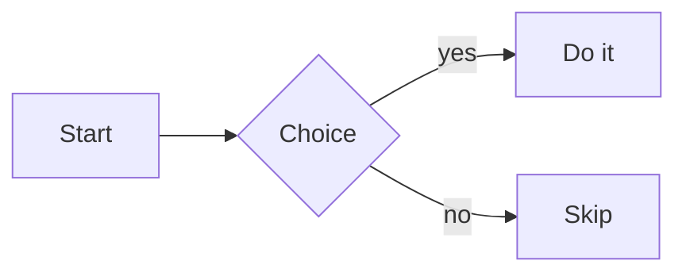

# Diagrams <Badge type="warning" text="Preview" />

Render diagrams inside markdown from a fenced code block — <code>```mermaid</code>
— using [`@cocoar/vue-markdown-mermaid`](https://www.npmjs.com/package/@cocoar/vue-markdown-mermaid).
The diagram source lives in the markdown as a normal code fence, so it
round-trips losslessly and **degrades to a readable code block** anywhere the
renderer isn't installed (strict CommonMark, a viewer-only build, a native mobile
renderer).

::: info Two mechanisms, two shapes
A **fenced code block** is for content whose *body is authored text in a DSL* —
diagrams, code. A [custom embed](/components/markdown-embeds) (`:::key{props}`) is
for a *single-line reference + a few props* rendered by a rich, visually-edited
component (e.g. a map). Diagrams belong in a fence; the map belongs in an embed.
:::

::: tip Two packages
The renderer lives in the standalone, markdown-free **`@cocoar/vue-mermaid`**
([`<CoarMermaidDiagram :code>`](/components/mermaid) — usable anywhere).
**`@cocoar/vue-markdown-mermaid`** is the thin adapter that registers it as a
fence renderer. Rendering a diagram **outside** markdown? See the
[**Mermaid Diagram**](/components/mermaid) page.
:::

<preview path="./markdown-diagrams/demos/MarkdownDiagrams.vue" />

## How it works

The markdown packages have **no dependency on Mermaid**. `<CoarMarkdown>` exposes
an open, language-keyed **fence-renderer registry**: register a component for a
fence language and that language renders through it instead of as a plain code
block. Installing `@cocoar/vue-markdown-mermaid` and registering it is the opt-in.

- **On disk** a diagram is a fenced code block with the `mermaid` info string.
  It's ordinary CommonMark — nothing custom to parse.
- **Rendering** is client-only (Mermaid needs a DOM) and lazy — Mermaid is
  dynamically imported on the first diagram, so viewer pages without one never
  pay for it.
- **Theming** maps Cocoar design tokens onto Mermaid's `themeVariables`, so
  diagrams match the app's fonts and palette.
- **Security**: Mermaid runs with `securityLevel: 'strict'` — author diagram text
  is treated as untrusted (HTML in labels is sanitized).
- **Invalid diagrams** degrade to an error box that still shows the raw source;
  they never throw up to the app.

## Install

```bash
pnpm add @cocoar/vue-markdown-mermaid
```

`vue` and `@cocoar/vue-markdown` are peer dependencies; `@cocoar/vue-mermaid`
(which carries Mermaid, dynamically imported on first render) comes along as a
regular dependency. Import its stylesheet once (diagram wrapper, error box, zoom
viewport):

```ts
import '@cocoar/vue-mermaid/styles';
```

## Usage

Pass the ready-made registry fragment to the viewer's `fenceRenderers` prop:

```vue
<template>
  <CoarMarkdown :doc="doc" :fence-renderers="mermaidFenceRenderers" />
</template>

<script setup lang="ts">
import { parse } from '@cocoar/vue-markdown-core';
import { CoarMarkdown } from '@cocoar/vue-markdown';
import { mermaidFenceRenderers } from '@cocoar/vue-markdown-mermaid';

const doc = parse(source);
</script>
```

A diagram in the source is just a fenced code block (shown here inside a wider
fence so it isn't rendered):

````text

````

An app-wide default works too — `app.provide(MARKDOWN_FENCE_RENDERERS_KEY, mermaidFenceRenderers)`.
A per-instance `fence-renderers` prop wins over the provided value.

## Zoom & pan

Per-diagram options are configured on the **registry** (the fence contract only
passes `{ code, language }` to a component), via `createMermaidFenceRenderers`:

```ts
import { createMermaidFenceRenderers } from '@cocoar/vue-markdown-mermaid';

const fenceRenderers = createMermaidFenceRenderers({ zoomable: true });
```

Each diagram then sits in a fixed-height viewport with **+ / − / ⤢** controls,
**Ctrl/⌘ + wheel** zoom, **drag** to pan and **double-click** to reset. Plain
wheel and one-finger touch scrolling are left to the page, so a diagram never
traps the scroll. Set the height with the `--coar-mermaid-height` CSS variable
(default `420px`).

## Registering your own fence renderer

The registry is open — any language can be mapped to any component. Register your
own (e.g. a Graphviz renderer) alongside Mermaid, or replace Mermaid entirely:

```ts
import type { FenceRegistry } from '@cocoar/vue-markdown';
import { mermaidFenceRenderers } from '@cocoar/vue-markdown-mermaid';
import MyGraphviz from './MyGraphviz.vue';

// Component receives `{ code, language }` (FenceRendererProps).
const fenceRenderers: FenceRegistry = {
  ...mermaidFenceRenderers,
  dot: MyGraphviz,
};
```

A registered component receives the fence's raw text as `code` and the info
string as `language`. This is the same seam a future BPMN or PlantUML renderer
would plug into — no change to the markdown core.

## API reference

### `@cocoar/vue-markdown`

| Export | Description |
|---|---|
| `FenceRegistry` | `Record<string, Component>` — fence language → renderer component. Keys match case-insensitively. |
| `FenceRendererProps` | `{ code: string; language: string }` — props a registered renderer receives. |
| `MARKDOWN_FENCE_RENDERERS_KEY` | Inject key for an app-wide registry. |
| `resolveFenceRenderer(registry, language)` | The case-insensitive lookup used by `DefaultCodeBlock`. |

### `@cocoar/vue-markdown-mermaid` (the fence adapter)

| Export | Description |
|---|---|
| `mermaidFenceRenderers` | Ready-to-spread `FenceRegistry` fragment (`{ mermaid }`), no zoom. |
| `createMermaidFenceRenderers(options?)` | Build a registry with options baked in — `{ zoomable }`. |

### `@cocoar/vue-mermaid` (the standalone renderer)

| Export | Description |
|---|---|
| `CoarMermaidDiagram` | The renderer component (`{ code, language, zoomable }` props). Use directly to render diagrams outside markdown. |
| `buildMermaidThemeVariables(getToken, resolveColor?)` | Pure Cocoar-token → Mermaid-theme mapping. |
| `makeCssColorResolver()` / `readCssTokens(el?)` | Browser-backed color/token resolvers for the bridge. |
